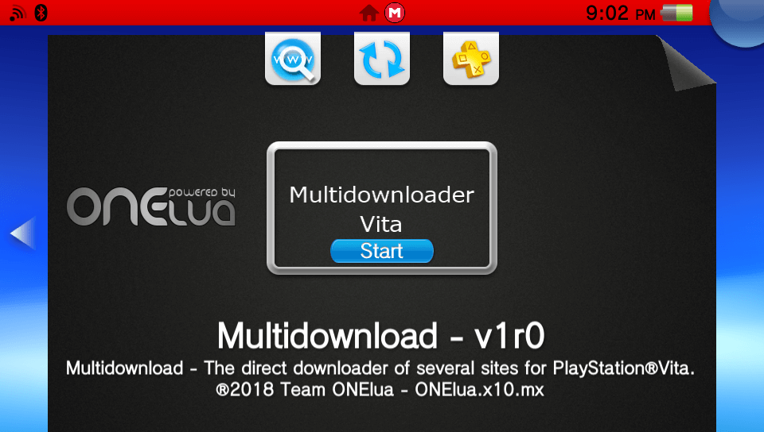
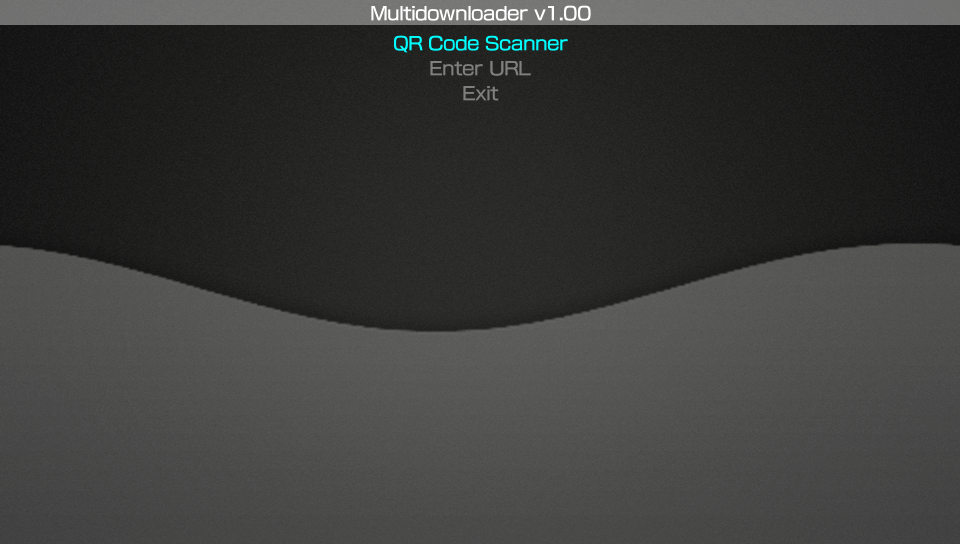

# Multidownload Vita     

Multidownload files for Play Station Vita..

### Description ###
This useful application allows you to download easily from http/https and direct in Mediafire/ Google Drive/ Zippyshare!

### Controls ###
- [up]/[down]: Browse the menu actions.
- [cross]: Perform the action selected in the menu.

### Changelog 1.0 ###
- Initial release.
- Added automatic network update. app will now notify you when there's a new update.
- Added the possibility to download direct in Mediafire/ Google Drive/ Zippyshare!
- You can enter the url in several ways, such as QR Code, URI or Manual.
- Support download/install/import at the time.

### URI ###
You can create a link on your page/server that allows *direct* download with *Multidownload*.
Like *mdl:down?<complete url to download>* examples:
- Download only, <a href='mdl:down?https://github.com/TheOfficialFloW/VitaShell/releases/download/1.96/VitaShell.vpk'>Direct download Vitashell with Multidownload</a>
- Download & Install vpk´s, <a href='mdl:install?https://github.com/TheOfficialFloW/VitaShell/releases/download/1.96/VitaShell.vpk'>Direct download & install Vitashell with Multidownload</a>
- Download & import Multimedia, <a href='mdl:media?https://www.google.com/images/branding/googlelogo/2x/googlelogo_color_272x92dp.png'>Direct download & import image or sound with Multidownload</a>

### Translations ###
If you want to help translate in your language, do not hesitate to contact me, please submit an issue or pull request.

### TO-DO ###
- Add more stuff (Suggestions are accepted).
The source code is too rudimentary and I hope to improve it :( , I wish to dedicate more time in the scene and do it soon.

### Note ###
Remember that this application the only thing you do is download directly from servers, you may have bandwidth restriction, if you do not have a premium account.

### Credits ###
- Mega-icon By **Papirus Development Team** GNU General Public License v3.0.

### Report bugs ###
if you see something wrong, please submit an issue or pull request.

### Donation ###
In case you want to support my work on the vita, you can always donate for some coffee. Any amount is highly appreciated:

